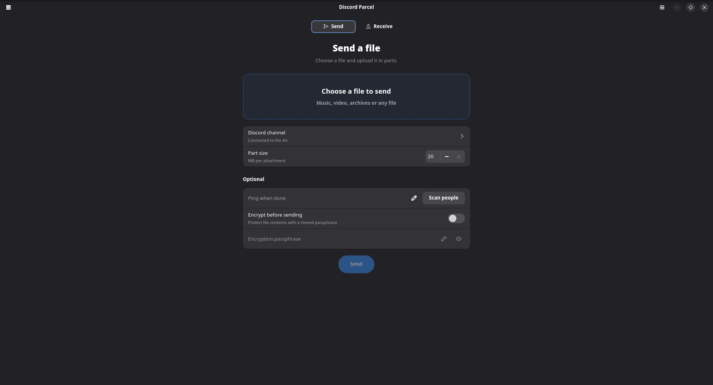
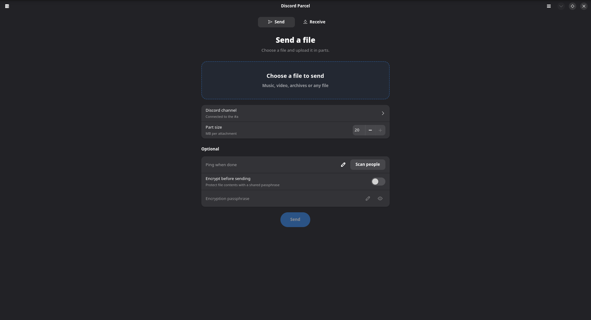

<p align="center">
  
</p>

<h1 align="center">Discord Parcel</h1>

<p align="center">
  <strong>Split, send, and restore files through Discord</strong><br>
  A desktop app built with Rust, GTK4, and libadwaita.
</p>

<p align="center">
  <a href="#gallery">Gallery</a> ·
  <a href="#get-started">Get started</a> ·
  <a href="#connect-discord">Connect Discord</a> ·
  <a href="#encryption-and-privacy">Encryption</a> ·
  <a href="#build-from-source">Build</a> ·
  <a href="https://github.com/ak4duy/discord-parcel/releases">Releases</a>
</p>

---

Drop a file into **Send**, upload its numbered parts to your Discord channel,
and share a `.parcel.json` transfer file or Discord message link. The receiver
opens it in **Receive** and restores the original, with SHA-256 verification.

**No transcoding. No quality loss.** Splitting preserves the original bytes.
Optional passphrase encryption protects file contents before they leave your device.

## Summary

| Feature                  | What it does                                                                 |
| :----------------------- | :--------------------------------------------------------------------------- |
| **Simple transfers**     | Drag and drop or pick a file; choose 1–20 MB parts.                          |
| **Resumable by design**  | Reuse completed uploads and verified cached downloads after an interruption. |
| **Verified restoration** | Check each part and the reconstructed file with SHA-256.                     |
| **Optional encryption**  | Encrypt file contents with a passphrase shared separately.                   |
| **Flexible sharing**     | Export a portable JSON manifest or copy a Discord message link.              |
| **Clear progress**       | Follow background transfers and stop them from the interface.                |
| **Safe output**          | Publish restored files atomically without overwriting existing files.        |

### How it works

| Step            | Action                                                                                       |
| :-------------- | :------------------------------------------------------------------------------------------- |
| **1 · Send**    | Choose a file, optionally enable encryption, and upload its parts with your Discord bot.     |
| **2 · Share**   | Save the transfer file or copy the message link. Share any encryption passphrase separately. |
| **3 · Restore** | Open the transfer in Receive, choose a destination, and select **Download and Restore**.     |

> To resume an upload, choose the same file, channel, bot, and part size again.
> Encrypted uploads also need the same passphrase.

### Gallery

|                          Send                           |                          Receive                           |
| :-----------------------------------------------------: | :--------------------------------------------------------: |
| [](data/gallery/pic1.png) | [](data/gallery/pic2.png) |

## Get started

### Windows

Download a Windows x64 **Setup.exe** from
[Releases](https://github.com/ak4duy/discord-parcel/releases),
or [build your own installer](#windows-installer-from-linux).

### Linux

Install the development dependencies and [build from source](#build-from-source).

Once the app is running, [connect your Discord bot](#connect-discord) to send files.
A recipient with a valid transfer file can download without a bot while its
attachment URLs remain valid.

## Connect Discord

1. Create an application and bot in the
   [Discord Developer Portal](https://discord.com/developers/applications).
2. Invite the bot to your server with **View Channel**, **Send Messages**,
   **Attach Files**, **Read Message History** and **Message Content Intent**.
3. Enable Discord's **Developer Mode** and copy the destination channel's ID.
4. Open **Connection settings** in application. Enter the bot token and
   channel ID, then save.

> [!IMPORTANT]
> Only **bot tokens** are supported.
> **Save Connection** remembers the bot token and channel in local `settings.json`.

## Receiving and expired links

The simplest handoff is the **`.parcel.json` file**.

| Transfer input                        | What the recipient needs                                                          |
| :------------------------------------ | :-------------------------------------------------------------------------------- |
| Manifest with valid attachment URLs   | The transfer file.                                                                |
| Manifest with expired attachment URLs | A bot with access to the source channel, or a refreshed manifest from the sender. |
| Discord message link                  | A connected bot that can read that message.                                       |
| Any encrypted transfer                | The encryption passphrase, in addition to the requirements above.                 |

## Encryption and privacy

| Property           | Implementation                                                                                                   |
| :----------------- | :--------------------------------------------------------------------------------------------------------------- |
| Encryption         | AES-256-GCM with random per-part nonces.                                                                         |
| Key derivation     | PBKDF2-HMAC-SHA256, 600,000 iterations, with a random salt.                                                      |
| Passphrase storage | Passphrases are not saved.                                                                                       |
| Download cache     | Encrypted parts remain encrypted on disk.                                                                        |
| Restoration        | Decryption/authentication and checksum checks precede final output publication.                                  |
| Compatibility      | Encrypted manifests use version 2 and need an encryption-capable Parcel release; version 1 manifests still work. |

> [!WARNING]
> Encryption protects **file contents**, not all metadata.
> Filenames, sizes, and checksums remain visible.

## Build from source

### Requirements

| Component  | Minimum version |
| :--------- | :-------------- |
| Rust       | **1.92**        |
| GTK        | **4.12**        |
| libadwaita | **1.5**         |

### Linux

**Arch / CachyOS**

```sh
sudo pacman -S --needed base-devel rust gtk4 libadwaita pkgconf
cargo run --release
```

**Ubuntu 24.04 / Debian with suitable GTK versions**

```sh
sudo apt install build-essential pkg-config libgtk-4-dev libadwaita-1-dev
cargo run --release
```

Open a transfer file directly:

```sh
cargo run --release -- /path/to/transfer.parcel.json
```

### Desktop integration

On Linux:

```sh
cargo build --release
make install PREFIX="$HOME/.local"
```

## Local data

| Platform | Default location                                                    |
| :------- | :------------------------------------------------------------------ |
| Linux    | `$XDG_DATA_HOME/discord-parcel`, or `~/.local/share/discord-parcel` |
| Windows  | `%LOCALAPPDATA%\discord-parcel`                                     |

| Path            | Contents                                                          |
| :-------------- | :---------------------------------------------------------------- |
| `settings.json` | Bot token, channel ID, and preferred part size.                   |
| `uploads/`      | Resumable upload checkpoints.                                     |
| `sent/`         | Completed transfer manifests.                                     |
| `downloads/`    | In-progress verified download parts.                              |
| `locks/`        | Advisory locks preventing concurrent writes to the same transfer. |

## Development

```sh
cargo fmt --check
cargo build --locked
cargo clippy --all-targets -- -D warnings
```

Check the file/transport engine without GTK development packages:

```sh
cargo check --no-default-features
```

## License

Copyright (c) 2026 **ak4duy**. Licensed under the
[GNU General Public License, version 3 only](LICENSE) (`GPL-3.0-only`).

---

<p align="center">
  Discord Parcel is an independent project, not affiliated with or endorsed by Discord.
</p>
